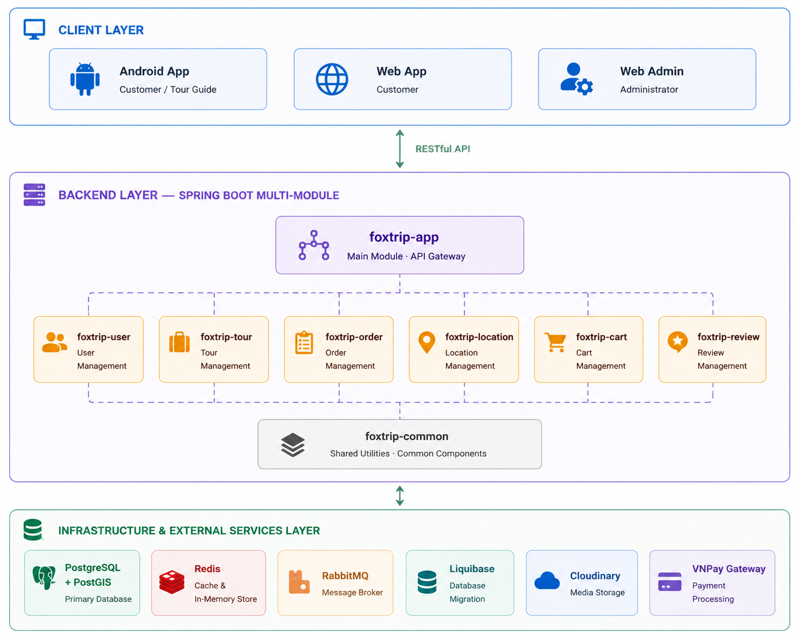
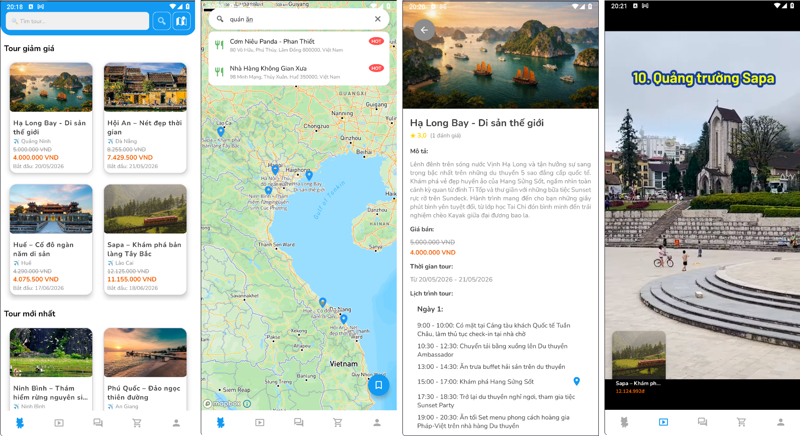
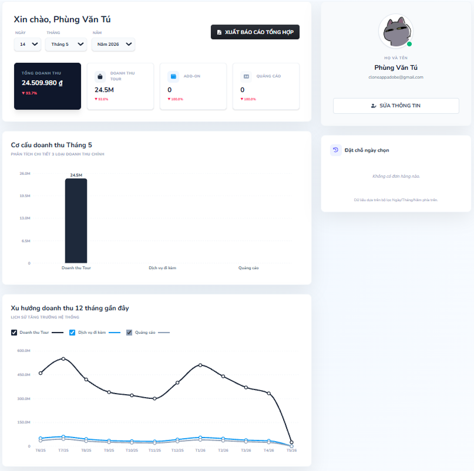
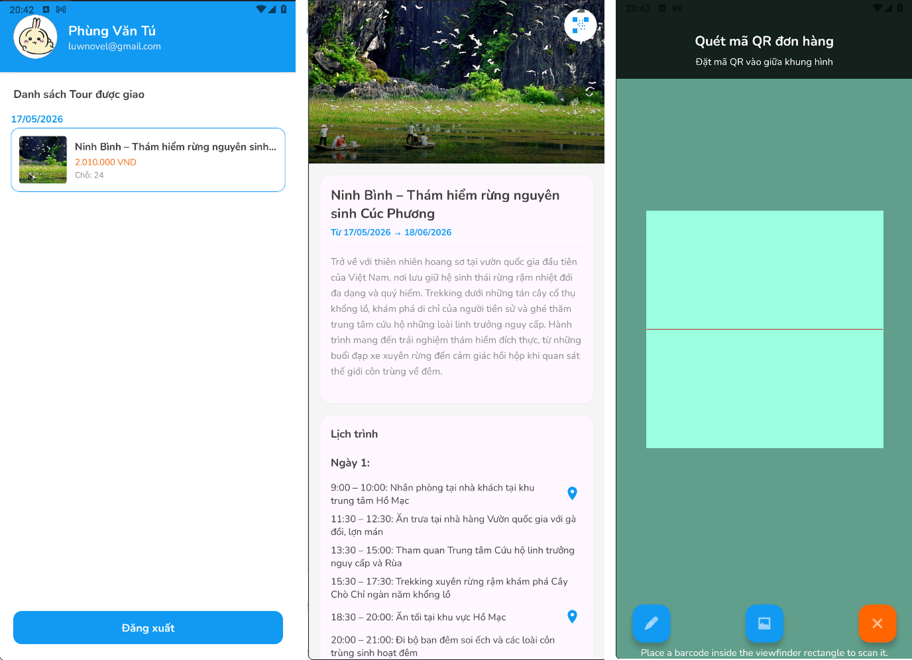

# Foxtrip - Hệ Thống Đặt Và Quản Lý Tour Du Lịch

[Tiếng Việt](README.md) | [Tiếng Anh](./doc/README_en.md)

## Tổng quan hệ thống
Foxtrip là hệ thống toàn diện hỗ trợ đặt và quản lý tour du lịch, bao gồm Backend REST API, Web Dashboard quản trị và ứng dụng di động Native Android dành cho khách hàng và hướng dẫn viên.

## Kiến trúc dự án
Dự án được xây dựng theo kiến trúc Client-Server:
- **Backend**: Spring Boot 3.x Gradle Multi-module phục vụ REST API.
- **Web Frontend**: React 19 SPA (Single Page Application) dành cho Admin quản lý và người dùng xem dashboard.
- **Mobile Client**: Native Android ứng dụng dành cho khách hàng đặt tour và hướng dẫn viên check-in.

## Công nghệ sử dụng
- **Backend**: Java 21, Spring Boot 3.4.5, Spring Security (JWT, OAuth2 Google), Spring Data JPA, Liquibase, MapStruct.
- **Web Dashboard**: React 19, Vite, Tailwind CSS 4, Axios, Zustand, Mapbox GL.
- **Mobile Android**: Java/Kotlin, ViewBinding, Retrofit, OkHttp, Glide, Mapbox SDK.
- **Hạ tầng & Dịch vụ**: PostgreSQL 17 (PostGIS), Redis 7, RabbitMQ 3, Docker, Cloudinary (Lưu ảnh), Groq AI (Llama-3.1), VNPay Sandbox (Thanh toán), Gmail SMTP.

## Chức năng chính
- **Khách hàng**: Tìm kiếm tour theo khoảng giá/danh mục/tỉnh thành, xem chi tiết lịch trình bản đồ, đặt tour kèm add-on dịch vụ, thanh toán online qua VNPay, chatbot Groq AI tư vấn.
- **Hướng dẫn viên (Guide)**: Xem lịch trình tour được phân công, xem danh sách hành khách, quét mã QR check-in hành khách đi tour.
- **Quản trị viên (Admin)**: Thiết lập tour & lịch trình chi tiết, quản lý địa điểm du lịch tích hợp bản đồ, phê duyệt hủy/hoàn tiền, quản lý người dùng, xem thống kê doanh thu đa chiều.

## Giao diện ứng dụng
Dưới đây là hình ảnh đại diện cho các giao diện chính trong hệ thống:

* **Giao diện người dùng (User Mobile)**:
  
* **Giao diện Admin (Web Dashboard)**:
  
* **Giao diện Hướng dẫn viên (Guide Mobile)**:
  

> [!NOTE]
> Các hình ảnh chi tiết khác (như Quản lý tour, địa điểm, đơn hàng, chatbot,...) được lưu trữ đầy đủ trong thư mục [screenshort](screenshort).

## Cấu trúc module Backend
- `foxtrip-app`: Module khởi chạy chính, chứa cấu hình hệ thống và REST controllers chung.
- `foxtrip-user`: Quản lý người dùng, tài khoản hướng dẫn viên, phân quyền và xác thực.
- `foxtrip-tour`: Định nghĩa thông tin tour, lịch trình các ngày, và add-on đính kèm.
- `foxtrip-location`: Quản lý địa danh du lịch, truy vấn không gian vị trí (PostGIS).
- `foxtrip-order`: Xử lý đơn hàng, tích hợp thanh toán VNPay, xử lý hủy đơn và hoàn tiền.
- `foxtrip-cart`: Quản lý giỏ hàng tạm thời của khách hàng.
- `foxtrip-review`: Quản lý đánh giá, xếp hạng sao của khách hàng sau khi đi tour.
- `foxtrip-common`: Chứa cấu hình bảo mật, xử lý lỗi exception và các DTO dùng chung.

## Database Overview
Hệ thống sử dụng PostgreSQL kết hợp extension PostGIS để quản lý và truy vấn tọa độ địa lý địa điểm du lịch (`geometry` Point).
Các thực thể chính:
- `users`: Tài khoản khách hàng, guide, admin.
- `tours` & `tour_itineraries` & `tour_addons`: Thông tin chi tiết tour du lịch.
- `locations`: Địa điểm tham quan và tọa độ bản đồ.
- `orders` & `order_items` & `order_addons`: Thông tin hóa đơn thanh toán và dịch vụ mua kèm.
- `refunds`: Xử lý hoàn trả tiền khi hủy tour.
- `carts` & `cart_items`: Quản lý giỏ hàng trực tuyến.
- `reviews`: Đánh giá của khách hàng.
- `revenue_reports`: Báo cáo doanh thu hàng tháng.

## Hướng dẫn cấu hình môi trường (Bắt buộc)
Để chạy dự án, bạn cần chuẩn bị và điền các API key, token và file sau:

### 1. Phía ứng dụng Android:
- **Tải Mapbox SDK (`local.properties`)**: Điền `MAPBOX_DOWNLOADS_TOKEN` vào file [android/local.properties](android/local.properties) để cấp quyền tải SDK.
- **Google Client ID & Mapbox Access Token (`config.xml`)**: Cấu hình tại file [android/app/src/main/res/values/config.xml](android/app/src/main/res/values/config.xml).
- **Google Services (`google-services.json`)**: Tải về từ Firebase Console của bạn và đặt file vào thư mục [android/app](android/app).

### 2. Phía ứng dụng Backend:
Cấu hình các API key tích hợp dịch vụ trong file [backend/foxtrip-app/src/main/resources/application.yml](backend/foxtrip-app/src/main/resources/application.yml):
- Google OAuth2 Client ID (`application.auth.google.client-id`)
- Cloudinary Storage (`application.cloudinary` cloud-name, api-key, api-secret)
- Cặp khóa JWT RSA (`jwt.public-key` và `jwt.private-key` dạng RS256 Base64/PEM)
- Cấu hình VNPay Gateway (`foxtrip.vnpay` tmn-code và hash-secret)
- Key bảo mật ký số QR Check-in (`foxtrip.qr.secret-key`)
- Groq AI Chatbot API key (`foxtrip.groq.api-key`)
- Goong Maps API key và Map key (`foxtrip.goong` api-key và map-key)
- Tài khoản gửi Mail SMTP (`spring.mail` username và password ứng dụng)

---

## Đường dẫn tài liệu & Ảnh
- **Database Schema/Script**: Chi tiết cấu trúc cơ sở dữ liệu tại [doc/db_design.md](doc/db_design.md) và các script Liquibase tự động tại [changelog](backend/foxtrip-app/src/main/resources/config/liquibase/changelog).
- **Sơ đồ & Ảnh chụp**:
  - Sơ đồ kiến trúc: [architecture.png](picture/architecture.png)
  - Luồng xử lý Main Thread: [main_thread.png](picture/main_thread.png)
  - Thư mục chứa toàn bộ ảnh giao diện thực tế: [screenshort](screenshort)
- **API Documentation**: Tài liệu swagger chi tiết tại `http://<host>:8080/swagger-ui/index.html` (khi backend đang chạy) hoặc qua Docker container `swagger-ui` tại `http://localhost:8083`.
